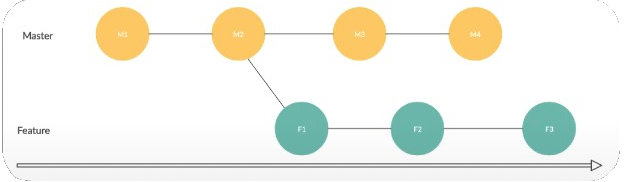
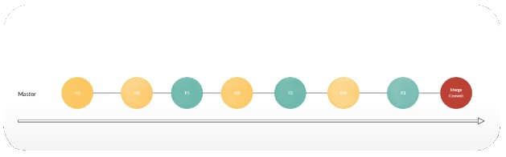
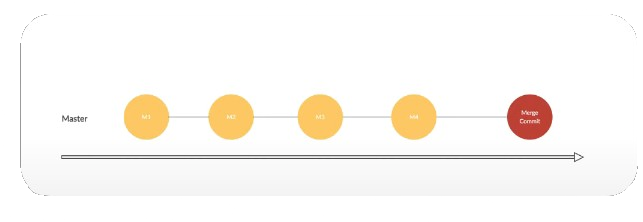
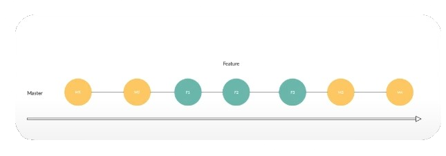

# 2 - Branch's (Merge, Squash e Rebase)

### git checkout
```
git checkout -b feature/client // cria a branch 'feature/client' e entra nela
git checkout master // vai para a branch 'master'
```


### git branch

```
git branch // lista as branch's disponíveis
git branch -d dev // remove a branch 'dev'
```

### git merge

```
git checkout master // vai para a branch 'master'
git merge feature/client // faz o merge da branch 'feature/client' na branch 'master' porque estava ativo na master
```

## Cenário



## Merge

```
git merge feature
```



## Squash

```
git merge feature --squash // junta a branch 'feature' na master mas não faz commit
git commit -m "merged feature branch' 

// usado para deixar a branch 'master' mais limpa
```



## Rebase

```
git rebase feature //junta todos os commits da ramificação no ponto onde foi criado 
/*
Muito cuidado ao usar ja que não da para usar o reset para voltar
Usado normalmente para fazer o rebase da 'master' para a branch 'feature'
*/
```
