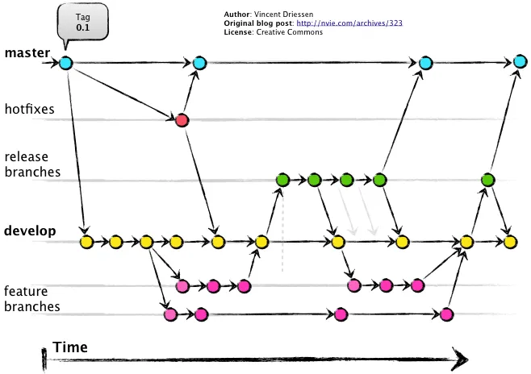

# Git Flow

[gitflow-workflow](https://www.atlassian.com/git/tutorials/comparing-workflows/gitflow-workflow)



## git flow init

## branch's

- master
- develop
- feature/
- release/
- hotfix/
- support/

```
cd gitflow // entra na pasta do projeto

git flow init // inicializa o git flow
// cria as branches bases
[master]
[develop]
[feature/]
[bugfix/]
[release/]
[hotfix/]
[support/]

git branch // lista as branches
*develop
 master

git flow feature start sum // cria uma branch 'feature/sum'
// faz os commits da feature
// ao terminar a feature.

/*
Faz o merge na branch 'develop' e remove a branch 'feature/sum'
Retorna para a branch 'develop'
*/
git flow feature finish sum

git flow release start 0.1.0 // cria a  branch 'release/0.1.0'
// No caso seria uma branch para homologação

/*
Faz o merge na branch 'master'
Envia para a 'origin'
Cria uma tag com '0.1.0'
Faz o merge (back-merged) com a branch 'develop'
Retorna para a branch 'develop'
*/
git flow release finish 0.1.0
```
